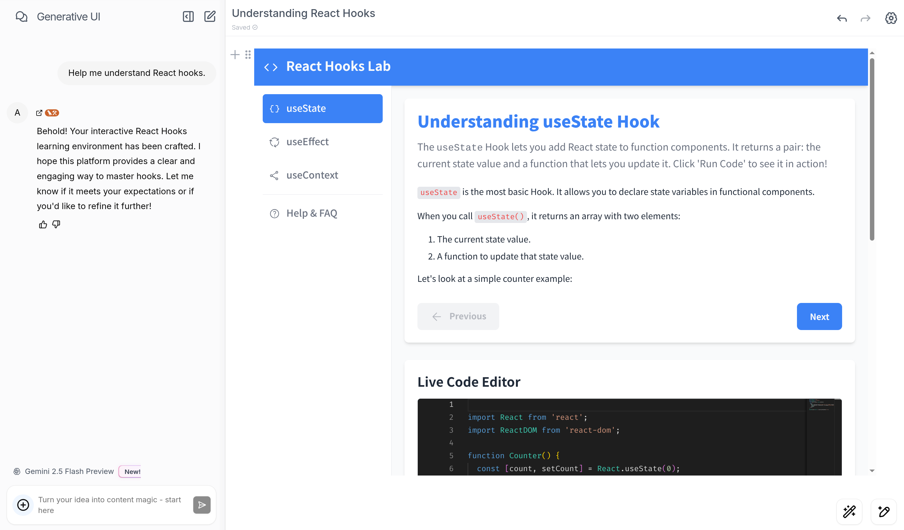

# Generating UI



Generating UI is an open source web application that leverages AI agents to solve user problems by generating interactive UI interfaces. Built on top of [Open Canvas](https://github.com/langchain-ai/open-canvas), this project focuses specifically on transforming natural language requirements into functional user interfaces.

## Key Capabilities

1. **UI-First Problem Solving**: Generating UI specializes in understanding user problems and creating appropriate UI solutions, from simple forms to complex interactive components.
2. **Built on Open Canvas**: Inherits all the powerful features of Open Canvas including memory systems, reflection agents, and collaborative editing capabilities.
3. **Natural Language to UI**: Advanced pipeline that converts user descriptions into working UI code with proper state management and styling.
4. **Interactive Development**: Users can iterate on generated UIs through natural conversation, refining and enhancing the interface in real-time.

## Core Features

- **Intelligent UI Generation**: Automatically creates UI components and interfaces based on user requirements and problem descriptions
- **Memory-Powered Personalization**: Built-in memory system that remembers user preferences, design patterns, and UI requirements across sessions for more personalized experiences
- **Custom UI Quick Actions**: Define reusable UI patterns and components that can be applied with a single click, tailored to your specific needs
- **Pre-built UI Templates**: Comprehensive library of pre-built UI components and templates for common interface patterns
- **UI Version Control**: All generated UI artifacts have full version history, allowing you to explore different design iterations and revert to previous versions
- **Live Preview & Editing**: Real-time rendering of generated UI with seamless switching between code view and visual preview
- **Multi-Format Output**: Generate complete UI solutions including HTML, CSS, JavaScript, and documentation in a unified workflow

## Architecture Overview

# System Design

**Generating UI** is built on top of **Open Canvas**, extending its finite state machine architecture to focus specifically on UI generation workflows. The system operates through intelligent state transitions, where each state corresponds to a different phase of UI creation - from requirement analysis to final rendering.

The core state management is handled through `const builder = new StateGraph(OpenCanvasGraphAnnotation)` in `agents/src/open-canvas/index.ts`, with all user interactions flowing through the `generatePath` function. Each node in the system leverages Large Language Models (LLMs) to perform specialized UI generation tasks, with implementations located in `agents/src/open-canvas/nodes/` and prompts centralized in `agents/open-canvas/prompts.ts`.

# Enhanced UI Generation Pipeline

Building on Open Canvas's foundation, **Generating UI** introduces two key enhancements:

1. **Intelligent Requirements Analysis:**  
   Advanced logic that analyzes user problems and automatically determines the most appropriate UI solution, from simple components to complex interactive interfaces.

2. **Comprehensive UI Rendering Pipeline:**  
   A sophisticated rendering system that transforms generated UI code into fully functional, styled interfaces with proper state management and interactivity.

## Setup Locally

### Prerequisites

Generating UI requires the following API keys and external services:

#### Package Manager

- [Yarn](https://yarnpkg.com/)

#### APIs

- [OpenAI API key](https://platform.openai.com/signup/)
- [Anthropic API key](https://console.anthropic.com/)
- (optional) [Google GenAI API key](https://aistudio.google.com/apikey)
- (optional) [Fireworks AI API key](https://fireworks.ai/login)
- (optional) [Groq AI API key](https://groq.com) - audio/video transcription
- (optional) [FireCrawl API key](https://firecrawl.dev) - web scraping
- (optional) [ExaSearch API key](https://exa.ai) - web search


#### Authentication

- [Supabase](https://supabase.com/) account for authentication

#### LangGraph Server

- [LangGraph CLI](https://langchain-ai.github.io/langgraph/cloud/reference/cli/) for running the graph locally

#### LangSmith

- [LangSmith](https://smith.langchain.com/) for tracing & observability

### Installation

First, clone the repository:

```bash
git clone <your-generating-ui-repository-url>
cd generating-ui
```

Next, install the dependencies:

```bash
yarn install
```

After installing dependencies, copy the contents of both `.env.example` files in the root of the project, and in `apps/web` into `.env` and set the required values:

```bash
# The root `.env` file will be read by the LangGraph server for the agents.
cp .env.example .env
```

```bash
# The `apps/web/.env` file will be read by the frontend.
cd apps/web/
cp .env.example .env
```

Then, setup authentication with Supabase.

### Setup Authentication

After creating a Supabase account, visit your [dashboard](https://supabase.com/dashboard/projects) and create a new project.

Next, navigate to the `Project Settings` page inside your project, and then to the `API` tag. Copy the `Project URL`, and `anon public` project API key. Paste them into the `NEXT_PUBLIC_SUPABASE_URL` and `NEXT_PUBLIC_SUPABASE_ANON_KEY` environment variables in the `apps/web/.env` file.

After this, navigate to the `Authentication` page, and the `Providers` tab. Make sure `Email` is enabled (also ensure you've enabled `Confirm Email`). You may also enable `GitHub`, and/or `Google` if you'd like to use those for authentication. (see these pages for documentation on how to setup each provider: [GitHub](https://supabase.com/docs/guides/auth/social-login/auth-github), [Google](https://supabase.com/docs/guides/auth/social-login/auth-google))

#### Test authentication

To verify authentication works, run `yarn dev` and visit [localhost:3000](http://localhost:3000). This should redirect you to the [login page](http://localhost:3000/auth/login). From here, you can either login with Google or GitHub, or if you did not configure these providers, navigate to the [signup page](http://localhost:3000/auth/signup) and create a new account with an email and password. This should then redirect you to a conformation page, and after confirming your email you should be redirected to the [home page](http://localhost:3000).

### Setup LangGraph Server

The first step to running **Generating UI** locally is to build the application. This project uses a monorepo setup inherited from Open Canvas, and requires workspace dependencies to be built so other packages/apps can access them.

Run the following command from the root of the repository:

```bash
yarn build
```

Now we'll cover how to setup and run the LangGraph server locally for the UI generation pipeline.

Navigate to `apps/agents` and run `yarn dev` (this runs `