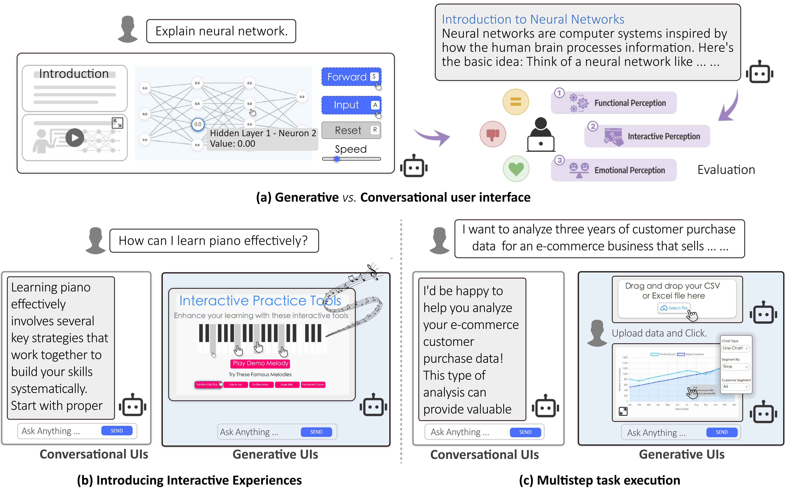
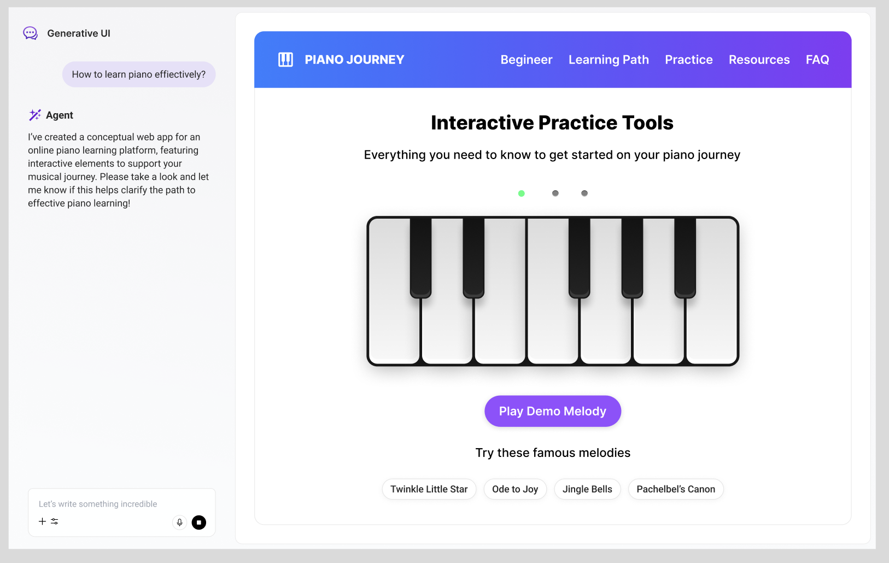

<br />
<p align="center">
<a href="https://genertiveui.github.io/" target="_blank">
  
</a>
</p>
Jiaqi Chen*, Yanzhe Zhang*, Yutong Zhang, Yijia Shao, Diyi Yang

Stanford University

*Equal contribution
<br />
<h3 align="center">
  <b><a href="https://genertiveui.github.io/">Homepage</a></b>
  •
  <b><a href="https://genertiveui.github.io/">Paper</a></b>
  •
  <b><a href="https://github.com/SALT-NLP/GenUI">Repo</a></b>

## What is Generative UIs?
<p align="center">
<a href="https://genertiveui.github.io/" target="_blank">
  
</a>
</p>
<p align="center">
We investigate Generative Interfaces for Language Models, a paradigm where LLMs respond to user queries by proactively generating user interfaces (UIs) to enable more adaptive, interactive interactions that better support complex user goals.

## How Generative UI works?
<p align="center">
<a href="https://genertiveui.github.io/" target="_blank">
  
</a>
</p>
<p align="center">

- **Requirement specification** [[system prompt](https://github.com/SALT-NLP/GenUI/blob/main/apps/agents/src/open-canvas/prompts.ts#L960)]: First, we parse the input into a requirement specification, capturing the main goal, desired features, UI components, interaction styles, and problem-solving strategies.

- **Structured interface-specific representation generation** [[system prompt](https://github.com/SALT-NLP/GenUI/blob/main/apps/agents/src/open-canvas/prompts.ts#L960)]: Second, we generate a Structured Interface-Specific Representation based on the requirement specification.

- **UI generation** [[system prompt](https://github.com/SALT-NLP/GenUI/blob/main/apps/agents/src/open-canvas/prompts.ts#L1458)]: To support faithful realization of the structured specification, we utilize a component codebase containing reusable implementations of common UI elements (e.g., charts, videos, synchronized clocks). In addition, a web retrieval module gathers relevant UI examples and data sources to inform both the representation design and the final rendering.
Finally, the entire context, including the natural language query, requirement specification, structured representation, 7 predefined components, and retrieved examples, is passed to a code generation model, which synthesizes executable HTML/CSS/JS code. This completes the pipeline from query to fully rendered, high-quality interactive interface.

- **Adaptive reward function** [[system prompt](https://github.com/SALT-NLP/GenUI/blob/main/apps/agents/src/open-canvas/prompts.ts#L1591)]: We use a large language model to automatically generate evaluation criteria based on each user query, such as “clarity” or “concept explanation,” assigning weights and verification rules to compute an overall score.

- **Iterative refinement** [[system prompt](https://github.com/SALT-NLP/GenUI/blob/main/apps/agents/src/open-canvas/prompts.ts#L1642)]: We first generate several UI candidates and score them using the reward function. The best one is selected, then used to guide the next round of generation. This process repeats with feedback until a candidate meets the quality threshold.


## Setup
</p>
<br />
<p align="center">
<a href="https://genertiveui.github.io/" target="_blank">
  
</a>
</p>
<br />
### Prerequisites

Generating UI requires the following API keys and external services:

#### Package Manager

- [Yarn](https://yarnpkg.com/)

#### APIs

- [OpenAI API key](https://platform.openai.com/signup/)
- [Anthropic API key](https://console.anthropic.com/)
- (optional) [Google GenAI API key](https://aistudio.google.com/apikey)
- (optional) [Fireworks AI API key](https://fireworks.ai/login)
- (optional) [Groq AI API key](https://groq.com) - audio/video transcription
- (optional) [FireCrawl API key](https://firecrawl.dev) - web scraping
- (optional) [ExaSearch API key](https://exa.ai) - web search


#### Authentication

- [Supabase](https://supabase.com/) account for authentication

#### LangGraph Server

- [LangGraph CLI](https://langchain-ai.github.io/langgraph/cloud/reference/cli/) for running the graph locally

#### LangSmith

- [LangSmith](https://smith.langchain.com/) for tracing & observability

### Installation

First, clone the repository:

```bash
git clone git@github.com:SALT-NLP/GenUI.git
cd GenUI
```

Next, install the dependencies:

```bash
yarn install
```

After installing dependencies, copy the contents of both `.env.example` files in the root of the project, and in `apps/web` into `.env` and set the required values:

```bash
# The root `.env` file will be read by the LangGraph server for the agents.
cp .env.example .env
```

```bash
# The `apps/web/.env` file will be read by the frontend.
cd apps/web/
cp .env.example .env
```

Then, setup authentication with Supabase.

### Setup Authentication

After creating a Supabase account, visit your [dashboard](https://supabase.com/dashboard/projects) and create a new project.

Next, navigate to the `Project Settings` page inside your project, and then to the `API` tag. Copy the `Project URL`, and `anon public` project API key. Paste them into the `NEXT_PUBLIC_SUPABASE_URL` and `NEXT_PUBLIC_SUPABASE_ANON_KEY` environment variables in the `apps/web/.env` file.

After this, navigate to the `Authentication` page, and the `Providers` tab. Make sure `Email` is enabled (also ensure you've enabled `Confirm Email`). You may also enable `GitHub`, and/or `Google` if you'd like to use those for authentication. (see these pages for documentation on how to setup each provider: [GitHub](https://supabase.com/docs/guides/auth/social-login/auth-github), [Google](https://supabase.com/docs/guides/auth/social-login/auth-google))

#### Test authentication

To verify authentication works, run `yarn dev` and visit [localhost:3000](http://localhost:3000). This should redirect you to the [login page](http://localhost:3000/auth/login). From here, you can either login with Google or GitHub, or if you did not configure these providers, navigate to the [signup page](http://localhost:3000/auth/signup) and create a new account with an email and password. This should then redirect you to a conformation page, and after confirming your email you should be redirected to the [home page](http://localhost:3000).

### Setup LangGraph Server

The first step to running Generating UI locally is to build the application. This is because Generating UI uses a monorepo setup, and requires workspace dependencies to be built so other packages/apps can access them.

Run the following command from the root of the repository:

```bash
yarn build
```

Now we'll cover how to setup and run the LangGraph server locally.

Navigate to `apps/agents` and run `yarn dev` (this runs `npx @langchain/langgraph-cli dev --port 54367`).

```
Ready!
- 🚀 API: http://localhost:54367
- 🎨 Studio UI: https://smith.langchain.com/studio?baseUrl=http://localhost:54367
```

After your LangGraph server is running, execute the following command inside `apps/web` to start the Generating UI frontend:

```bash
yarn dev
```

On initial load, compilation may take a little bit of time.

Then, open [localhost:3000](http://localhost:3000) with your browser and start generating UI!

# Citation
If you find this work useful for your research, please cite our github repo:
```bibtex
@misc{chen2025generative,
    title = {Beyond Chat: Generative Interfaces for Language Models},
    author = {Chen, Jiaqi and Zhang, Yanzhe and Zhang, Yutong and Shao, Yijia and Yang, Diyi},
    year = {2025}
}
```
